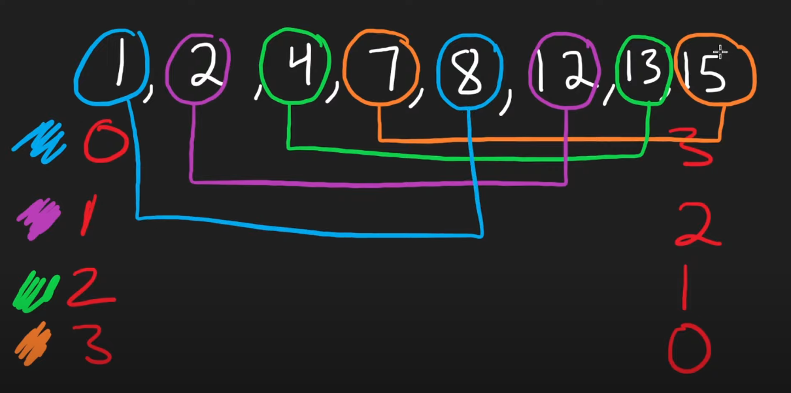

#### This image explains how when we remove one from left we would remove three from right
#### and get the same index value, given that we have to do 3 moves and remove 3 elements.
#### so we can only sort largest four and smallest four and iterate on them to get smallest difference.